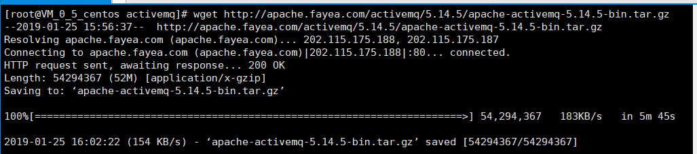
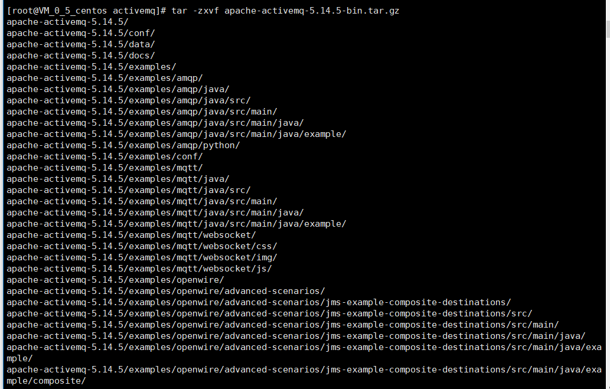
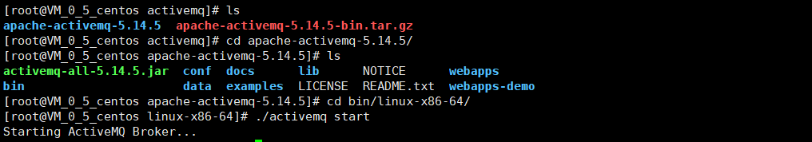
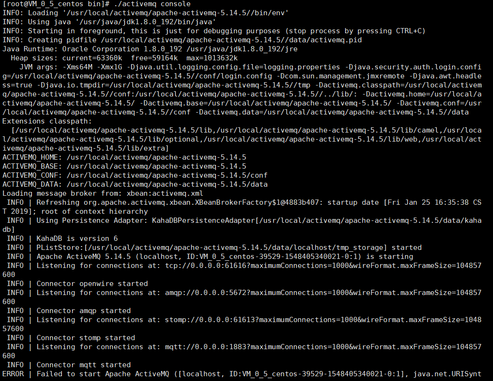
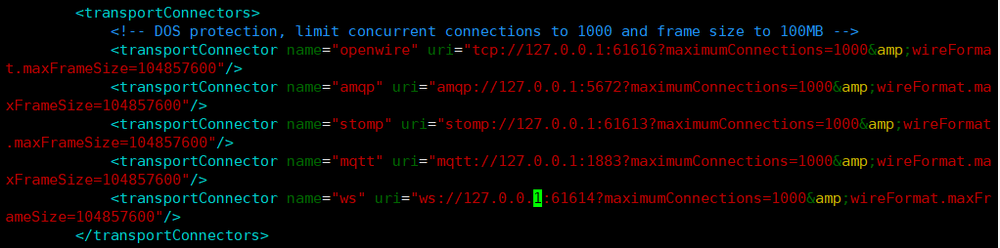
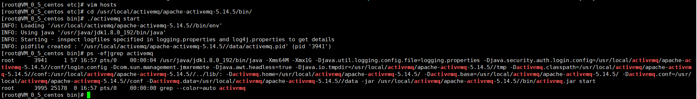
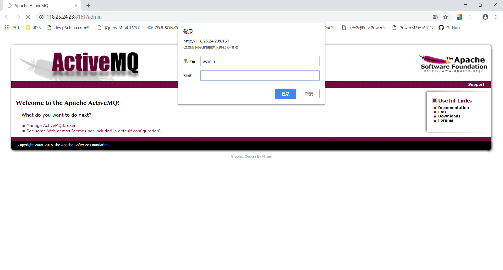
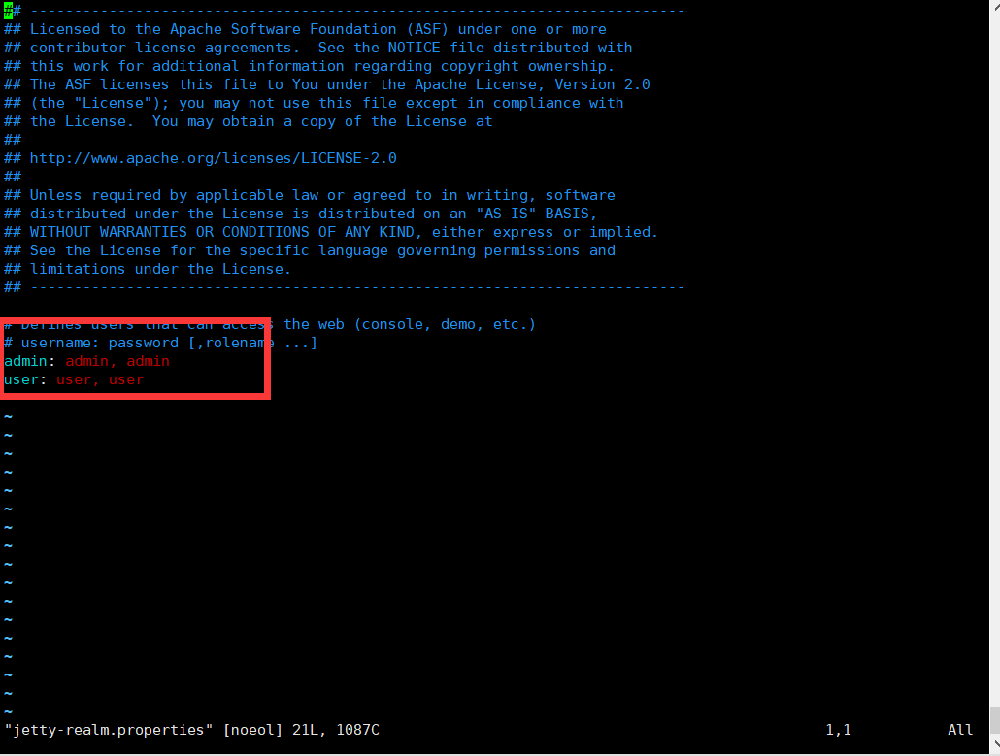
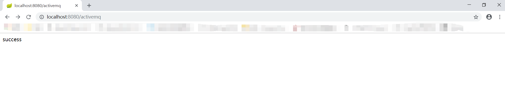
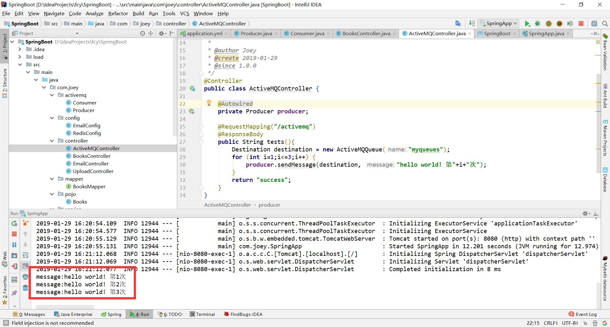

## CentOS 7.2安装ActiveMQ 5.14.5

#### 1. 下载安装包

```shell
[root@VM_0_5_centos activemq]# wget http://apache.fayea.com/activemq/5.14.5/apache-activemq-5.14.5-bin.tar.gz
```



#### 2. 解压压缩包

```shel
[root@VM_0_5_centos activemq]# tar -zxvf apache-activemq-5.14.5-bin.tar.gz 
```



#### 3. 进入bin文件下的Linux文件下启动

```shell
[root@VM_0_5_centos activemq]# ls
apache-activemq-5.14.5  apache-activemq-5.14.5-bin.tar.gz
[root@VM_0_5_centos activemq]# cd apache-activemq-5.14.5/
[root@VM_0_5_centos apache-activemq-5.14.5]# ls
activemq-all-5.14.5.jar  conf  docs      lib      NOTICE      webapps
bin                      data  examples  LICENSE  README.txt  webapps-demo
[root@VM_0_5_centos apache-activemq-5.14.5]# cd bin/linux-x86-64/
[root@VM_0_5_centos linux-x86-64]# ./activemq start
Starting ActiveMQ Broker...
```



#### 4. 查看启动状态

```shell
#activemq未启动
[root@VM_0_5_centos bin]# ps -ef|grep activemq
root      2756 25178  0 16:44 pts/0    00:00:00 grep --color=auto activemq
```

#### 5. 查看启动日志，解决报错

```shell
[root@VM_0_5_centos bin]# ./activemq console
```



1.  **报错原因**

```shell
ERROR | Failed to start Apache ActiveMQ ([localhost, ID:VM_0_5_centos-39529-1548405340021-0:1], java.net.URISyntaxException: Illegal character in hostname at index 7: ws://VM_0_5_centos:61614?maximumConnections=1000&wireFormat.maxFrameSize=104857600)
```

2. **修改conf目录下的activemq.xml文件**

```shell
[root@VM_0_5_centos bin]# cd ..
[root@VM_0_5_centos apache-activemq-5.14.5]# cd conf/
[root@VM_0_5_centos conf]# ls
activemq.xml           client.ks                   groups.properties       jmx.access          login.config
broker.ks              client.ts                   java.security           jmx.password        users.properties
broker-localhost.cert  credentials-enc.properties  jetty-realm.properties  log4j.properties
broker.ts              credentials.properties      jetty.xml               logging.properties
[root@VM_0_5_centos conf]# vim activemq.xml 
#将127.0.0.1修改为0.0.0.0 【重新改为0.0.0.0 否则后续远程连接访问报错】
```



3. **始终报错，修改etc/hosts文件，删除映射到VM_0_5_centos的配置**
4. **重新启动，运行activemq，查看运行状态**

```shell
[root@VM_0_5_centos bin]# ./activemq status
INFO: Loading '/usr/local/activemq/apache-activemq-5.14.5//bin/env'
INFO: Using java '/usr/java/jdk1.8.0_192/bin/java'
ActiveMQ is running (pid '3941')
```



5. **访问8161管理员页面,使用配置的账号密码登录**



6. **进入conf文件夹下配置文件，修改密码**

```shell
[root@VM_0_5_centos apache-activemq-5.14.5]# cd conf/
[root@VM_0_5_centos conf]# ls
activemq.xml           client.ks                   groups.properties       jmx.access          login.config
broker.ks              client.ts                   java.security           jmx.password        users.properties
broker-localhost.cert  credentials-enc.properties  jetty-realm.properties  log4j.properties
broker.ts              credentials.properties      jetty.xml               logging.properties
[root@VM_0_5_centos conf]# vim jetty-realm.properties 
```



#### 6. SpringBoot整合ActiveMQ

1. maven引入jar包

```xml
<!--整合activemq-->
<dependency>
    <groupId>org.springframework.boot</groupId>
    <artifactId>spring-boot-starter-activemq</artifactId>
    <version>2.1.2.RELEASE</version>
</dependency>
```

2. 编辑配置文件

```yaml
spring:    
  activemq:
    broker-url: tcp://IP+端口号61616
    in-memory: true
    user: admin
    password: admin
    pool:
      enabled: false
```

3. window客户端可使用telnet 命令查看端口是否可以访问

   ```
   telnet IP 端口号 例：telnet 127.0.0.1 8080
   ```

4. 编写服务提供方

   ```java
   package com.joey.activemq;
   import org.springframework.beans.factory.annotation.Autowired;
   import org.springframework.jms.core.JmsMessagingTemplate;
   import org.springframework.stereotype.Component;
   import javax.jms.Destination;
   /**
    * 〈服务者〉
    *
    * @author Joey
    * @create 2019-01-28
    * @since 1.0.0
    */
   @Component
   public class Producer {
   
       @Autowired
       private JmsMessagingTemplate jmsMessagingTemplate;
   
       public void sendMessage(Destination destination, final String message){
           jmsMessagingTemplate.convertAndSend(destination, message);
       }
   
   }
   ```

5. 编写消费方

   ```java
   package com.joey.activemq;
   import org.springframework.jms.annotation.JmsListener;
   import org.springframework.stereotype.Component;
   /**
    * 〈消费者〉
    *
    * @author Joey
    * @create 2019-01-29
    * @since 1.0.0
    */
   @Component
   public class Consumer {
   
       @JmsListener(destination = "myqueues")
       public void receiveMsg(String message){
           System.out.println("message:"+message);
       }
   }
   ```

6. 编写控制器

   ```java
   package com.joey.controller;
   import com.joey.activemq.Producer;
   import org.apache.activemq.command.ActiveMQQueue;
   import org.springframework.beans.factory.annotation.Autowired;
   import org.springframework.stereotype.Controller;
   import org.springframework.web.bind.annotation.RequestMapping;
   import org.springframework.web.bind.annotation.ResponseBody;
   import javax.jms.Destination;
   
   @Controller
   public class ActiveMQController {
   
       @Autowired
       private Producer producer;
   
       @RequestMapping("/activemq")
       @ResponseBody
       public String tests(){
           Destination destination = new ActiveMQQueue("myqueues");
           for (int i=1;i<=3;i++) {
               producer.sendMessage(destination, "hello world! 第"+i+"次");
           }
           return "success";
       }
   }
   ```

7. 访问成功

   

