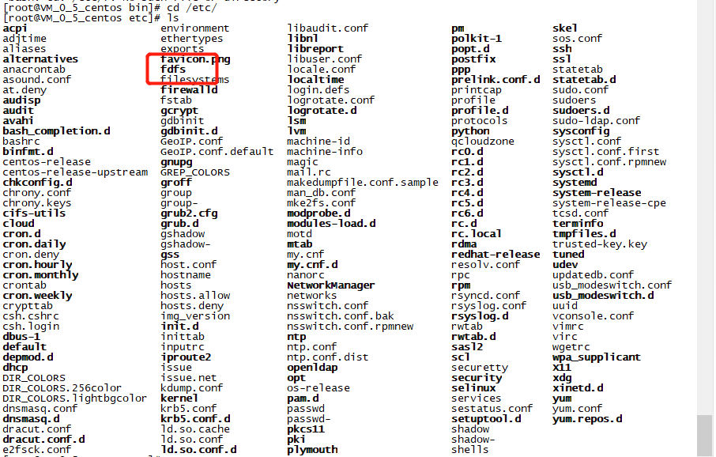

## CentOS 7.2安装ActiveMQ 5.14.5

#### 1. 安装基本环境

```shell
[root@VM_0_5_centos ~]# yum -y install libevent
Loaded plugins: fastestmirror, langpacks
Repodata is over 2 weeks old. Install yum-cron? Or run: yum makecache fast
epel                                                                                  | 4.9 kB  00:00:00     
extras                                                                                | 3.4 kB  00:00:00     
mysql-connectors-community                                                            | 2.5 kB  00:00:00     
......                                     

Complete!
```

> 看到Complete!就是安装成功了

#### 2. 创建fastDFS下载安装libfastcommon-1.0.7.tar.gz

```shell
[root@VM_0_5_centos /]# cd /usr/local/
[root@VM_0_5_centos local]# mkdir fastDFS
[root@VM_0_5_centos local]# cd fastDFS/
#下载libfastcommon-1.0.7.tar.gz
[root@VM_0_5_centos fastDFS]# wget https://github.com/happyfish100/libfastcommon/archive/V1.0.7.tar.gz
[root@VM_0_5_centos fastDFS]# ls
V1.0.7.tar.gz
#重命名V1.0.7.tar.gz文件
[root@VM_0_5_centos fastDFS]# mv V1.0.7.tar.gz libfastcommon-1.0.7.tar.gz
[root@VM_0_5_centos fastDFS]# ls
libfastcommon-1.0.7.tar.gz
#解压文件
[root@VM_0_5_centos fastDFS]# tar -zxvf libfastcommon-1.0.7.tar.gz 
#进入解压后的目录
[root@VM_0_5_centos fastDFS]# cd libfastcommon-1.0.7/
#编译
[root@VM_0_5_centos libfastcommon-1.0.7]# ./make.sh 
#安装
[root@VM_0_5_centos libfastcommon-1.0.7]# ./make.sh install
#安装tracker（跟踪器）服务 FastDFS_v5.05.tar.gz
[root@VM_0_5_centos libfastcommon-1.0.7]# wget https://github.com/happyfish100/fastdfs/archive/V5.05.tar.gz
[root@VM_0_5_centos libfastcommon-1.0.7]# ls
HISTORY  INSTALL  libfastcommon.spec  make.sh  README  src  V5.05.tar.gz
#重命名 V5.05.tar.gz文件
[root@VM_0_5_centos libfastcommon-1.0.7]# mv V5.05.tar.gz FastDFS_v5.05.tar.gz
[root@VM_0_5_centos libfastcommon-1.0.7]# ls
FastDFS_v5.05.tar.gz  HISTORY  INSTALL  libfastcommon.spec  make.sh  README  src
#解压文件
[root@VM_0_5_centos libfastcommon-1.0.7]# tar -zxvf FastDFS_v5.05.tar.gz 
#进入解压后的目录
[root@VM_0_5_centos libfastcommon-1.0.7]# cd fastdfs-5.05/
#编译
[root@VM_0_5_centos fastdfs-5.05]# ./make.sh 
#安装
[root@VM_0_5_centos fastdfs-5.05]# ./make.sh install
```

#### 3.  安装配置启动tracker和storage



```shell
[root@VM_0_5_centos etc]# cd fdfs/
[root@VM_0_5_centos fdfs]# ls
client.conf.sample  storage.conf.sample  tracker.conf.sample
#复制一份配置文件
[root@VM_0_5_centos fdfs]# cp /etc/fdfs/tracker.conf.sample /etc/fdfs/tracker.conf
[root@VM_0_5_centos fdfs]# ls
client.conf.sample  storage.conf.sample  tracker.conf  tracker.conf.sample
#修改配置文件
[root@VM_0_5_centos fdfs]# vim tracker.conf
# is this config file disabled
# false for enabled
# true for disabled
disabled=false

# bind an address of this host
# empty for bind all addresses of this host
bind_addr=

# the tracker server port
port=22122

# connect timeout in seconds
# default value is 30s
connect_timeout=30

# network timeout in seconds
# default value is 30s
network_timeout=60

# the base path to store data and log files
base_path=/home/yuqing/fastdfs

# max concurrent connections this server supported
max_connections=256

# accept thread count
# default value is 1
# since V4.07
accept_threads=1

# work thread count, should <= max_connections
# default value is 4
# since V2.00
work_threads=4

# the method of selecting group to upload files
# 0: round robin
# 1: specify group
# 2: load balance, select the max free space group to upload file
store_lookup=2

# which group to upload file
# when store_lookup set to 1, must set store_group to the group name
store_group=group2

# which storage server to upload file
# 0: round robin (default)
# 1: the first server order by ip address
# 2: the first server order by priority (the minimal)
store_server=0

# which path(means disk or mount point) of the storage server to upload file
# 0: round robin
# 2: load balance, select the max free space path to upload file
store_path=0

# which storage server to download file
# 0: round robin (default)
# 1: the source storage server which the current file uploaded to
download_server=0

# reserved storage space for system or other applications.
# if the free(available) space of any stoarge server in
# a group <= reserved_storage_space,
# no file can be uploaded to this group.
# bytes unit can be one of follows:
### G or g for gigabyte(GB)
### M or m for megabyte(MB)
### K or k for kilobyte(KB)
### no unit for byte(B)
### XX.XX% as ratio such as reserved_storage_space = 10%
reserved_storage_space = 10%

#standard log level as syslog, case insensitive, value list:
### emerg for emergency
### alert
### crit for critical
### error
### warn for warning
### notice
### info
### debug
log_level=info

#unix group name to run this program,
#not set (empty) means run by the group of current user
run_by_group=

#unix username to run this program,
#not set (empty) means run by current user
run_by_user=

# allow_hosts can ocur more than once, host can be hostname or ip address,
# "*" means match all ip addresses, can use range like this: 10.0.1.[1-15,20] or
# host[01-08,20-25].domain.com, for example:
# allow_hosts=10.0.1.[1-15,20]
# allow_hosts=host[01-08,20-25].domain.com
allow_hosts=*

# sync log buff to disk every interval seconds
# default value is 10 seconds
sync_log_buff_interval = 10

# check storage server alive interval seconds
check_active_interval = 120

search hit BOTTOM, continuing at TOP                                                       
# is this config file disabled
# false for enabled
# true for disabled
disabled=false

# bind an address of this host
# empty for bind all addresses of this host
bind_addr=

# the tracker server port
port=22122

# connect timeout in seconds
# default value is 30s
connect_timeout=30

# network timeout in seconds
# default value is 30s
network_timeout=60

# the base path to store data and log files
#存放数据和日志文件的路径 需要修改
base_path=/home/yuqing/fastdfs

# max concurrent connections this server supported
max_connections=256

# accept thread count
# default value is 1
# since V4.07
accept_threads=1

# work thread count, should <= max_connections
# default value is 4
# since V2.00
work_threads=4

# the method of selecting group to upload files
# 0: round robin
# 1: specify group
# 2: load balance, select the max free space group to upload file
store_lookup=2

# which group to upload file
# when store_lookup set to 1, must set store_group to the group name
store_group=group2

# which storage server to upload file
# 0: round robin (default)
# 1: the first server order by ip address
# 2: the first server order by priority (the minimal)
store_server=0

# which path(means disk or mount point) of the storage server to upload file
# 0: round robin
# 2: load balance, select the max free space path to upload file
store_path=0

# which storage server to download file
# 0: round robin (default)
# 1: the source storage server which the current file uploaded to
download_server=0

# reserved storage space for system or other applications.
# if the free(available) space of any stoarge server in
# a group <= reserved_storage_space,
# no file can be uploaded to this group.
# bytes unit can be one of follows:
### G or g for gigabyte(GB)
### M or m for megabyte(MB)
### K or k for kilobyte(KB)
### no unit for byte(B)
### XX.XX% as ratio such as reserved_storage_space = 10%
reserved_storage_space = 10%

#standard log level as syslog, case insensitive, value list:
### emerg for emergency
### alert
### crit for critical
### error
### warn for warning
### notice
### info
### debug
log_level=info

#unix group name to run this program,
#not set (empty) means run by the group of current user
run_by_group=

#unix username to run this program,
#not set (empty) means run by current user
run_by_user=

# allow_hosts can ocur more than once, host can be hostname or ip address,
# "*" means match all ip addresses, can use range like this: 10.0.1.[1-15,20] or
# host[01-08,20-25].domain.com, for example:
# allow_hosts=10.0.1.[1-15,20]
# allow_hosts=host[01-08,20-25].domain.com
allow_hosts=*

# sync log buff to disk every interval seconds
# default value is 10 seconds
sync_log_buff_interval = 10

# check storage server alive interval seconds
check_active_interval = 120

# thread stack size, should >= 64KB
# default value is 64KB
thread_stack_size = 64KB

# auto adjust when the ip address of the storage server changed
# default value is true
storage_ip_changed_auto_adjust = true

# storage sync file max delay seconds
# default value is 86400 seconds (one day)
# since V2.00
storage_sync_file_max_delay = 86400

# the max time of storage sync a file
# default value is 300 seconds
# since V2.00
storage_sync_file_max_time = 300

# if use a trunk file to store several small files
# default value is false
# since V3.00
use_trunk_file = false

# the min slot size, should <= 4KB
# default value is 256 bytes
# since V3.00
slot_min_size = 256

# the max slot size, should > slot_min_size
# store the upload file to trunk file when it's size <=  this value
# default value is 16MB
# since V3.00
slot_max_size = 16MB

# the trunk file size, should >= 4MB
# default value is 64MB
# since V3.00
trunk_file_size = 64MB

# if create trunk file advancely
# default value is false
# since V3.06
trunk_create_file_advance = false

# the time base to create trunk file
# the time format: HH:MM
# default value is 02:00
# since V3.06
trunk_create_file_time_base = 02:00

# the interval of create trunk file, unit: second
# default value is 38400 (one day)
# since V3.06
trunk_create_file_interval = 86400

# the threshold to create trunk file
# when the free trunk file size less than the threshold, will create
# the trunk files
# default value is 0
# since V3.06
trunk_create_file_space_threshold = 20G

# if check trunk space occupying when loading trunk free spaces
# the occupied spaces will be ignored
# default value is false
# since V3.09
# NOTICE: set this parameter to true will slow the loading of trunk spaces
# when startup. you should set this parameter to true when neccessary.
trunk_init_check_occupying = false

# if ignore storage_trunk.dat, reload from trunk binlog
# default value is false
# since V3.10
# set to true once for version upgrade when your version less than V3.10
trunk_init_reload_from_binlog = false

# the min interval for compressing the trunk binlog file
# unit: second
# default value is 0, 0 means never compress
# FastDFS compress the trunk binlog when trunk init and trunk destroy
# recommand to set this parameter to 86400 (one day)
# since V5.01
trunk_compress_binlog_min_interval = 0

# if use storage ID instead of IP address
# default value is false
# since V4.00
use_storage_id = false

# specify storage ids filename, can use relative or absolute path
# since V4.00
storage_ids_filename = storage_ids.conf

# id type of the storage server in the filename, values are:
## ip: the ip address of the storage server
## id: the server id of the storage server
# this paramter is valid only when use_storage_id set to true
# default value is ip
# since V4.03
id_type_in_filename = ip

# if store slave file use symbol link
# default value is false
# since V4.01
store_slave_file_use_link = false

# if rotate the error log every day
# default value is false
# since V4.02
rotate_error_log = false

# rotate error log time base, time format: Hour:Minute
# Hour from 0 to 23, Minute from 0 to 59
# default value is 00:00
# since V4.02
error_log_rotate_time=00:00

# rotate error log when the log file exceeds this size
# 0 means never rotates log file by log file size
# default value is 0
# since V4.02
rotate_error_log_size = 0

# keep days of the log files
# 0 means do not delete old log files
# default value is 0
log_file_keep_days = 0

# if use connection pool
# default value is false
# since V4.05
use_connection_pool = false

# connections whose the idle time exceeds this time will be closed
# unit: second
# default value is 3600
# since V4.05
connection_pool_max_idle_time = 3600

# HTTP port on this tracker server
http.server_port=8080

# check storage HTTP server alive interval seconds
# <= 0 for never check
# default value is 30
http.check_alive_interval=30

# check storage HTTP server alive type, values are:
#   tcp : connect to the storge server with HTTP port only,
#        do not request and get response
#   http: storage check alive url must return http status 200
# default value is tcp
http.check_alive_type=tcp

# check storage HTTP server alive uri/url
# NOTE: storage embed HTTP server support uri: /status.html
http.check_alive_uri=/status.html

#启动tracker服务
[root@VM_0_5_centos fdfs]# /usr/bin/fdfs_trackerd /etc/fdfs/tracker.conf
[2019-05-29 22:35:04] ERROR - file: process_ctrl.c, line: 189, "/home/yuqing/fastdfs" can't be accessed, error info: No such file or directory
#没有这个默认路径 报错 重新创建这个路径再启动
[root@VM_0_5_centos fdfs]# mkdir /home/yuqing
[root@VM_0_5_centos fdfs]# mkdir /home/yuqing/fastdfs
[root@VM_0_5_centos fdfs]# /usr/bin/fdfs_trackerd /etc/fdfs/tracker.conf
[root@VM_0_5_centos fdfs]# ps -ef|grep tracker
root      5697     1  0 22:36 ?        00:00:00 /usr/bin/fdfs_trackerd /etc/fdfs/tracker.conf
root      5739  2075  0 22:36 pts/0    00:00:00 grep --color=auto tracker
#启动成功，接下去安装storage服务
#复制一份配置文件
[root@VM_0_5_centos fdfs]# cp /etc/fdfs/storage.conf.sample /etc/fdfs/storage.conf
[root@VM_0_5_centos fdfs]# ls /etc/fdfs/
client.conf.sample  storage.conf  storage.conf.sample  tracker.conf  tracker.conf.sample
[root@VM_0_5_centos fdfs]# vim /etc/fdfs/storage.conf
# is this config file disabled
# false for enabled
# true for disabled
disabled=false

# the name of the group this storage server belongs to
#
# comment or remove this item for fetching from tracker server,
# in this case, use_storage_id must set to true in tracker.conf,
# and storage_ids.conf must be configed correctly.
group_name=group1

# bind an address of this host
# empty for bind all addresses of this host
bind_addr=

# if bind an address of this host when connect to other servers
# (this storage server as a client)
# true for binding the address configed by above parameter: "bind_addr"
# false for binding any address of this host
client_bind=true

# the storage server port
port=23000

# connect timeout in seconds
# default value is 30s
connect_timeout=30

# network timeout in seconds
# default value is 30s
network_timeout=60

# heart beat interval in seconds
heart_beat_interval=30

# disk usage report interval in seconds
stat_report_interval=60

# the base path to store data and log files
base_path=/home/yuqing/fastdfs

# max concurrent connections the server supported
# default value is 256
# more max_connections means more memory will be used
max_connections=256

# the buff size to recv / send data
# this parameter must more than 8KB
# default value is 64KB
# since V2.00
buff_size = 256KB

# accept thread count
# default value is 1
# since V4.07
accept_threads=1

# work thread count, should <= max_connections
# work thread deal network io
# default value is 4
# since V2.00
work_threads=4

# if disk read / write separated
##  false for mixed read and write
##  true for separated read and write
# default value is true
# since V2.00
disk_rw_separated = true

# disk reader thread count per store base path
# for mixed read / write, this parameter can be 0
# default value is 1
# since V2.00
disk_reader_threads = 1

# disk writer thread count per store base path
# for mixed read / write, this parameter can be 0
# default value is 1
# since V2.00
disk_writer_threads = 1

# when no entry to sync, try read binlog again after X milliseconds
# must > 0, default value is 200ms
sync_wait_msec=50

# after sync a file, usleep milliseconds
# 0 for sync successively (never call usleep)
sync_interval=0

# storage sync start time of a day, time format: Hour:Minute
# Hour from 0 to 23, Minute from 0 to 59
sync_start_time=00:00

# storage sync end time of a day, time format: Hour:Minute
# Hour from 0 to 23, Minute from 0 to 59
sync_end_time=23:59

# write to the mark file after sync N files
# default value is 500
write_mark_file_freq=500

# path(disk or mount point) count, default value is 1
store_path_count=1

# store_path#, based 0, if store_path0 not exists, it's value is base_path
# the paths must be exist
store_path0=/home/yuqing/fastdfs
#store_path1=/home/yuqing/fastdfs2

# subdir_count  * subdir_count directories will be auto created under each
# store_path (disk), value can be 1 to 256, default value is 256
subdir_count_per_path=256

# tracker_server can ocur more than once, and tracker_server format is
#  "host:port", host can be hostname or ip address
#修改tracker server 地址，改为云服务器的内外IP即可
tracker_server=192.168.209.121:22122

#standard log level as syslog, case insensitive, value list:
### emerg for emergency
### alert
### crit for critical
### error
### warn for warning
### notice
### info
### debug
log_level=info

#unix group name to run this program,
#not set (empty) means run by the group of current user
run_by_group=

#unix username to run this program,
#not set (empty) means run by current user
run_by_user=

# allow_hosts can ocur more than once, host can be hostname or ip address,
# "*" means match all ip addresses, can use range like this: 10.0.1.[1-15,20] or
# host[01-08,20-25].domain.com, for example:
# allow_hosts=10.0.1.[1-15,20]
# allow_hosts=host[01-08,20-25].domain.com
allow_hosts=*

# the mode of the files distributed to the data path
# 0: round robin(default)
# 1: random, distributted by hash code
file_distribute_path_mode=0

# valid when file_distribute_to_path is set to 0 (round robin),
# when the written file count reaches this number, then rotate to next path
# default value is 100
file_distribute_rotate_count=100

# call fsync to disk when write big file
# 0: never call fsync
# other: call fsync when written bytes >= this bytes
# default value is 0 (never call fsync)
fsync_after_written_bytes=0

# sync log buff to disk every interval seconds
# must > 0, default value is 10 seconds
sync_log_buff_interval=10

# sync binlog buff / cache to disk every interval seconds
# default value is 60 seconds
sync_binlog_buff_interval=10

# sync storage stat info to disk every interval seconds
# default value is 300 seconds
sync_stat_file_interval=300

# thread stack size, should >= 512KB
# default value is 512KB
thread_stack_size=512KB

# the priority as a source server for uploading file.
# the lower this value, the higher its uploading priority.
# default value is 10
upload_priority=10

# the NIC alias prefix, such as eth in Linux, you can see it by ifconfig -a
# multi aliases split by comma. empty value means auto set by OS type
# default values is empty
if_alias_prefix=

# if check file duplicate, when set to true, use FastDHT to store file indexes
# 1 or yes: need check
# 0 or no: do not check
# default value is 0
check_file_duplicate=0

# file signature method for check file duplicate
## hash: four 32 bits hash code
## md5: MD5 signature
# default value is hash
# since V4.01
file_signature_method=hash

# namespace for storing file indexes (key-value pairs)
# this item must be set when check_file_duplicate is true / on
key_namespace=FastDFS

# set keep_alive to 1 to enable persistent connection with FastDHT servers
# default value is 0 (short connection)
keep_alive=0

# you can use "#include filename" (not include double quotes) directive to
# load FastDHT server list, when the filename is a relative path such as
# pure filename, the base path is the base path of current/this config file.
# must set FastDHT server list when check_file_duplicate is true / on
# please see INSTALL of FastDHT for detail
##include /home/yuqing/fastdht/conf/fdht_servers.conf

# if log to access log
# default value is false
# since V4.00
use_access_log = false

# if rotate the access log every day
# default value is false
# since V4.00
rotate_access_log = false

# rotate access log time base, time format: Hour:Minute
# Hour from 0 to 23, Minute from 0 to 59
# default value is 00:00
# since V4.00
access_log_rotate_time=00:00

# if rotate the error log every day
# default value is false
# since V4.02
rotate_error_log = false

# rotate error log time base, time format: Hour:Minute
# Hour from 0 to 23, Minute from 0 to 59
# default value is 00:00
# since V4.02
error_log_rotate_time=00:00

# rotate access log when the log file exceeds this size
# 0 means never rotates log file by log file size
# default value is 0
# since V4.02
rotate_access_log_size = 0

# rotate error log when the log file exceeds this size
# 0 means never rotates log file by log file size
# default value is 0
# since V4.02
rotate_error_log_size = 0

# keep days of the log files
# 0 means do not delete old log files
# default value is 0
log_file_keep_days = 0

# if skip the invalid record when sync file
# default value is false
# since V4.02
file_sync_skip_invalid_record=false

# if use connection pool
# default value is false
# since V4.05
use_connection_pool = false

# connections whose the idle time exceeds this time will be closed
# unit: second
# default value is 3600
# since V4.05
connection_pool_max_idle_time = 3600

# use the ip address of this storage server if domain_name is empty,
# else this domain name will ocur in the url redirected by the tracker server
http.domain_name=

# the port of the web server on this storage server
http.server_port=8888

#修改完配置后启动
[root@VM_0_5_centos fdfs]# /usr/bin/fdfs_storaged /etc/fdfs/storage.conf
[root@VM_0_5_centos fdfs]# ps -ef|grep storage
root      6068     1  0 22:41 ?        00:00:00 /usr/bin/fdfs_storaged /etc/fdfs/storage.conf
root      6096  2075  0 22:41 pts/0    00:00:00 grep --color=auto storage
```

#### 4. 测试上传

```shell
[root@VM_0_5_centos nginx-1.11.8]# cd /opt
#下载图片至opt目录下
[root@VM_0_5_centos opt]# wget https://img.alicdn.com/tfs/TB1MaLKRXXXXXaWXFXXXXXXXXXX-480-260.png
#测试文件上传
[root@VM_0_5_centos opt]# /usr/bin/fdfs_test /etc/fdfs/client.conf upload /opt/TB1MaLKRXXXXXaWXFXXXXXXXXXX-480-260.png 
This is FastDFS client test program v5.05
Copyright (C) 2008, Happy Fish / YuQing
FastDFS may be copied only under the terms of the GNU General
Public License V3, which may be found in the FastDFS source kit.
Please visit the FastDFS Home Page http://www.csource.org/ 
for more detail.
[2019-05-29 23:30:31] ERROR - file: shared_func.c, line: 960, open file /etc/fdfs/client.conf fail, errno: 2, error info: No such file or directory
[2019-05-29 23:30:31] ERROR - file: ../client/client_func.c, line: 402, load conf file "/etc/fdfs/client.conf" fail, ret code: 2
#报错client配置文件错误，去修改配置文件发现tracker Ip没有配置
[root@VM_0_5_centos fdfs]# vim client.conf
#重新测试成功返回地址但是没有配置nginx访问不了
[root@VM_0_5_centos opt]# /usr/bin/fdfs_test /etc/fdfs/client.conf upload /opt/TB1MaLKRXXXXXaWXFXXXXXXXXXX-480-260.png 
This is FastDFS client test program v5.05
Copyright (C) 2008, Happy Fish / YuQing
FastDFS may be copied only under the terms of the GNU General
Public License V3, which may be found in the FastDFS source kit.
Please visit the FastDFS Home Page http://www.csource.org/ 
for more detail.
[2019-05-29 23:33:49] DEBUG - base_path=/home/yuqing/fastdfs, connect_timeout=30, network_timeout=60, tracker_server_count=1, anti_steal_token=0, anti_steal_secret_key length=0, use_connection_pool=0, g_connection_pool_max_idle_time=3600s, use_storage_id=0, storage server id count: 0
tracker_query_storage_store_list_without_group: 
        server 1. group_name=, ip_addr=118.25.24.23, port=23000
group_name=group1, ip_addr=118.25.24.23, port=23000
storage_upload_by_filename
group_name=group1, remote_filename=M00/00/00/rBEABVzupl2AZjmjAAAWa1r8PEU571.png
source ip address: 172.17.0.5
file timestamp=2019-05-29 23:33:49
file size=5739
file crc32=1526479941
example file url: http://118.25.24.23/group1/M00/00/00/rBEABVzupl2AZjmjAAAWa1r8PEU571.png
storage_upload_slave_by_filename
group_name=group1, remote_filename=M00/00/00/rBEABVzupl2AZjmjAAAWa1r8PEU571_big.png
source ip address: 172.17.0.5
file timestamp=2019-05-29 23:33:49
file size=5739
file crc32=1526479941
example file url: http://118.25.24.23/group1/M00/00/00/rBEABVzupl2AZjmjAAAWa1r8PEU571_big.png
```

#### 5.  安装Nginx和插件（有问题待修改）

> 下载Nginx
>
> ```shell
> [root@VM_0_5_centos fdfs]# cd /usr/local/
> [root@VM_0_5_centos local]# wget http://nginx.org/download/nginx-1.11.8.tar.gz
> ```
>
> 下载Nginx插件
>
> ```shell
> [root@VM_0_5_centos local]# wget http://nginx.org/download/nginx-1.11.8.tar.gz
> ```
>
> 解压Nginx模块
>
> ```shell
> [root@VM_0_5_centos local]# tar zxvf fastdfs-nginx-module_v1.16.tar.gz
> ```
>
> 编辑 Nginx 模块的配置文件
>
> 复制配置文件至/etc/fdfs/，编辑config文件删除路径种的local
>
> ```shell
> [root@VM_0_5_centos local]# cp fastdfs-nginx-module/src/mod_fastdfs.conf /etc/fdfs/
> [root@VM_0_5_centos local]# vim /etc/fdfs/mod_fastdfs.conf 
> [root@VM_0_5_centos src]# vim /fastdfs-nginx-module/src/config
> ngx_addon_name=ngx_http_fastdfs_module
> HTTP_MODULES="$HTTP_MODULES ngx_http_fastdfs_module"
> NGX_ADDON_SRCS="$NGX_ADDON_SRCS $ngx_addon_dir/ngx_http_fastdfs_module.c"
> CORE_INCS="$CORE_INCS /usr/include/fastdfs /usr/include/fastcommon/"
> CORE_LIBS="$CORE_LIBS -L/usr/lib -lfastcommon -lfdfsclient"
> CFLAGS="$CFLAGS -D_FILE_OFFSET_BITS=64 -DFDFS_OUTPUT_CHUNK_SIZE='256*1024' -DFDFS_MOD_CONF_FILENAME='\"/etc/fdfs/mod_fastdfs.conf\"'"
> ```
>
> 
>
> 进入解压后的nginx文件夹 运行./configure  根据出现问题进行处理没有再安装依赖包
>
> 安装Nginx依赖包
>
> ```shell
> [root@VM_0_5_centos nginx-1.11.8]# yum install -y gcc gcc-c++ pcre pcre-devel zlib zlib-devel openssl openssl-devel
> ```
>
> 新建文件夹
>
> ```shell
> [root@VM_0_5_centos nginx-1.11.8]# mkdir -p /usr/local/nginx /var/log/nginx /var/temp/nginx /var/lock/nginx
> ```
>
> 添加配置
>
> ```shell
> [root@VM_0_5_centos nginx-1.11.8]# ./configure --prefix=/usr/local/nginx --add-module=/usr/local/fastdfs-nginx-module/src/
> ```
>
> cp /usr/local/fastdfs-nginx-module/src/mod_fastdfs.conf /etc/fdfs