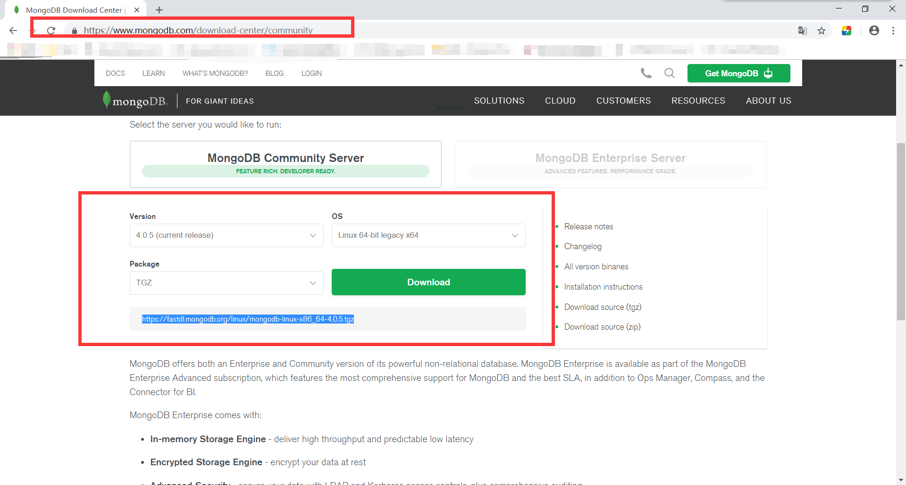
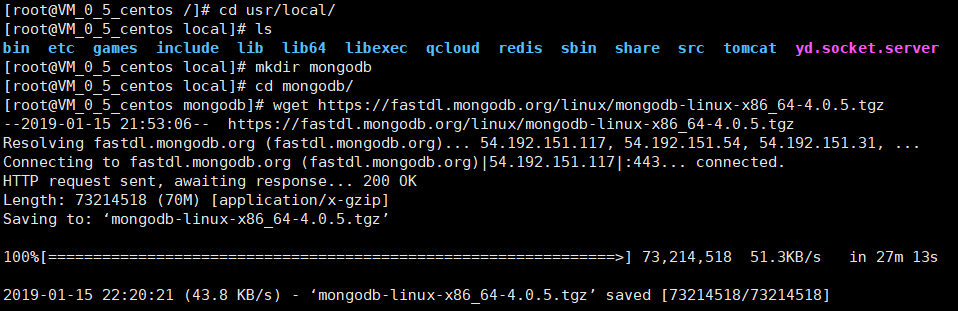
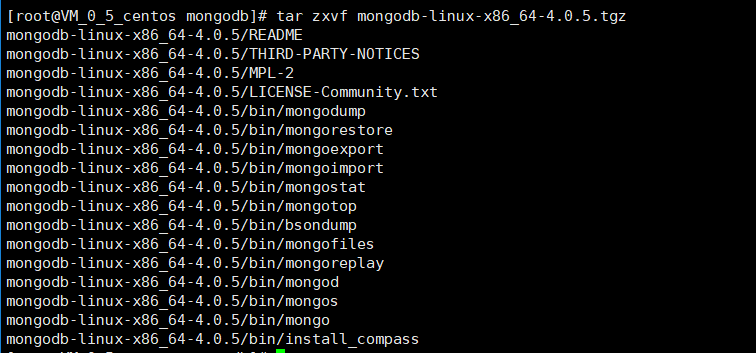
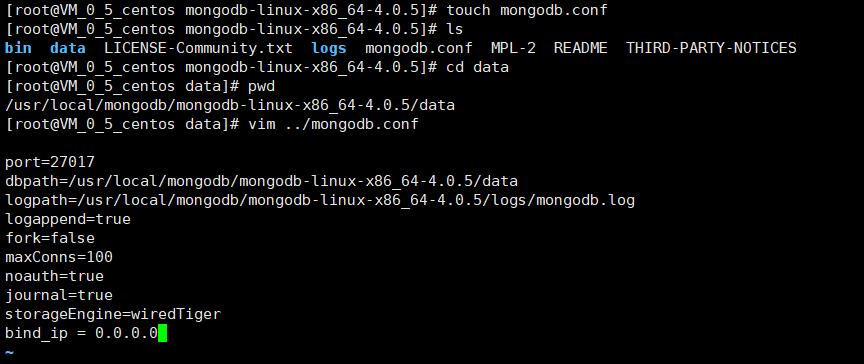
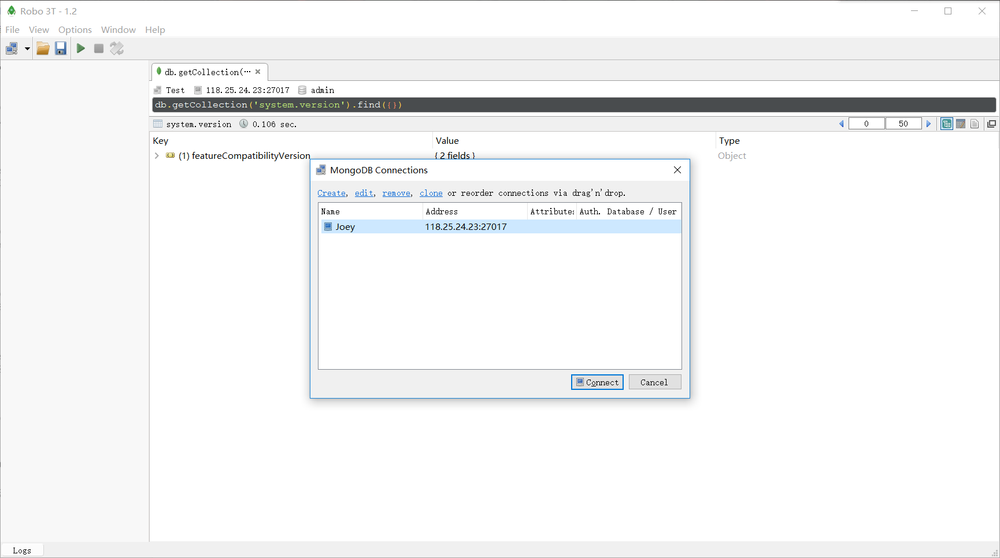
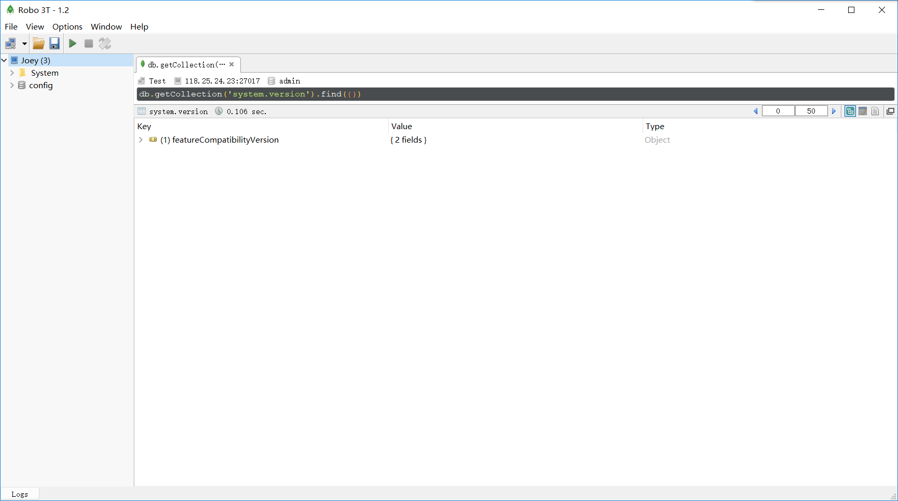
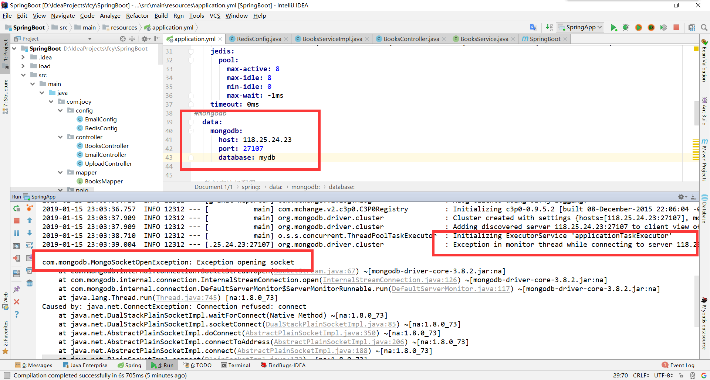

## CentOS 7.2安装MongoDB 4.0.5

#### 1. 下载安装包

> [MongoDB官网](https://www.mongodb.com/download-center/community)下载安装包上传至服务器或者获取下载链接使用wget命令



> 创建mongdb目录，使用wget命令下载压缩包



#### 2. 解压压缩包

```shell
[root@VM_0_5_centos mongodb]# tar zxvf mongodb-linux-x86_64-4.0.5.tgz
```



#### 3. 新建data文件夹用于存放数据，logs文件夹存放日志

```shell
[root@VM_0_5_centos mongodb-linux-x86_64-4.0.5]# mkdir data
[root@VM_0_5_centos mongodb-linux-x86_64-4.0.5]# mkdir logs
[root@VM_0_5_centos mongodb-linux-x86_64-4.0.5]# ls
bin  data  LICENSE-Community.txt  logs  MPL-2  README  THIRD-PARTY-NOTICES
```

#### 4. 新建一个配置文件mongodb.conf



```properties
#端口
port=27017
#数据库存文件存放目录
dbpath=/usr/local/mongodb/mongodb-linux-x86_64-4.0.5/data
#日志文件存放路径
logpath=/usr/local/mongodb/mongodb-linux-x86_64-4.0.5/data/mongodb.log
#使用追加的方式写日志
logappend=true
#在后台运行
fork=true 
#最大同时连接数
maxConns=100
#不启用验证
noauth=true
#每次写入会记录一条操作日志（通过journal可以重新构造出写入的数据）
journal=true
#存储引擎有mmapv1、wiretiger、mongorocks，即使宕机，启动时wiredtiger会先将数据恢复到最近一次的checkpoint点，然后重放后续的journal日志来恢复。
storageEngine=wiredTiger
#配置外部访问
bind_ip = 0.0.0.0
```

#### 5. 用配置文件启动MongoDB

```shell
[root@VM_0_5_centos bin]# ./mongod --config /usr/local/mongodb/mongodb-linux-x86_64-4.0.5/mongodb.conf 
about to fork child process, waiting until server is ready for connections.
forked process: 26478
child process started successfully, parent exiting
```

#### 6. 用RoBo连接MongoDB





#### 7. java连接MongoDB

> 出现报错



