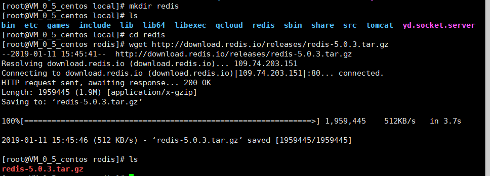
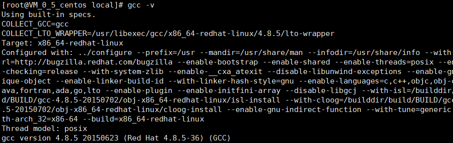
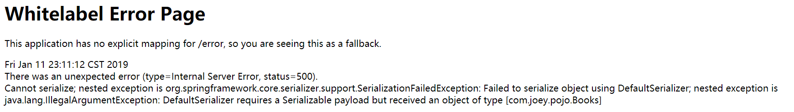
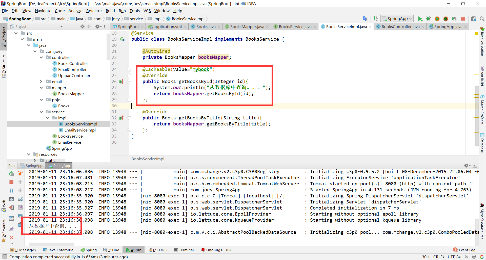
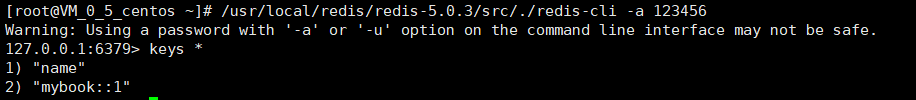

## Centos 7.2 安装目前最新版Redis5.0.3

#### 1. 下载安装包

```shell
[root@VM_0_5_centos redis]# wget http://download.redis.io/releases/redis-5.0.3.tar.gz
```



#### 2. 解压安装包

```shell
[root@VM_0_5_centos redis]# tar -zxvf redis-5.0.3.tar.gz 
```

#### 3. 进入解压后的目录，编译

> redis使用c语言开发的，所以编译依赖gcc环境，先查看是否安装了gcc



> 如果没有安装，先执行安装gcc命令

```shell
[root@VM_0_5_centos local]# yum -y install gcc-c++
```

> 再进行编译

```shell
[root@VM_0_5_centos redis]# cd redis-5.0.3/
[root@VM_0_5_centos redis-5.0.3]# make
```

#### 4. 修改配置文件

```shell
[root@VM_0_5_centos redis-5.0.3]# ls
00-RELEASENOTES  COPYING  Makefile   redis.conf       runtest-sentinel  tests
BUGS             deps     MANIFESTO  runtest          sentinel.conf     utils
CONTRIBUTING     INSTALL  README.md  runtest-cluster  src
[root@VM_0_5_centos redis-5.0.3]# vim redis.conf 
#修改绑定ip为0.0.0.0，支持远程访问
bind 0.0.0.0
# 指定日志文件目录
logfile "/usr/local/redis/log/server-out.log"
# 启用后台启动
daemonize yes
```

#### 5. 启动redis

> 进入src目录，用配置文件启动redis

```shell
#进入src目录
[root@VM_0_5_centos redis-5.0.3]# cd src
#启动redis
[root@VM_0_5_centos src]# ./redis-server ../redis.conf 
```

#### 6. 查看redis是否启动

```shell
[root@VM_0_5_centos src]# netstat -nlpt|grep 6379
```


```shell
[root@VM_0_5_centos src]# ps -aux|grep redis
root      7655  0.0  0.5 159456 10264 ?        Ssl  16:41   0:00 ./redis-server 0.0.0.0:6379
root      7971  0.0  0.0 112644   964 pts/0    R+   16:45   0:00 grep --color=auto redis
#进入redis客户端
[root@VM_0_5_centos src]# ./redis-cli 
```


#### 7. 给redis添加密码

```shell
[root@VM_0_5_centos src]# vim ../redis.conf 
#命令行状态/requirepass 按回车查找 ，n查找下一个，添加下面一行
requirepass 123456
```

#### 8. 重启redis

```shell
#关闭客户端
[root@VM_0_5_centos src]# ./redis-cli shutdown
#重启redis服务
[root@VM_0_5_centos src]# ./redis-server ../redis.conf 
#重新连接客户端（没有权限访问）
[root@VM_0_5_centos src]# ./redis-cli 
127.0.0.1:6379> keys *
(error) NOAUTH Authentication required.
#密码登录
[root@VM_0_5_centos src]# ./redis-cli -a 123456
Warning: Using a password with '-a' or '-u' option on the command line interface may not be safe.
127.0.0.1:6379> keys *
1) "name"
```

#### 9. SpringBoot连接redis

> 引入maven依赖

```xml
<!--整合单机版redis-->
<dependency>
    <groupId>org.springframework.boot</groupId>
    <artifactId>spring-boot-starter-data-redis</artifactId>
    <version>2.1.1.RELEASE</version>
</dependency>
```

> 添加配置

```yml
spring: 
  redis:
    database: 0
    host: 118.25.24.23
    port: 6379
    password: 123456
    jedis:
      pool:
        max-active: 8
        max-wait: -1
        max-idle: 8
        min-idle: 0
    timeout: 0
```

> 启动类开启缓存

```java
@SpringBootApplication
@EnableCaching
public class SpringApp {
    public static void main(String[] args) {
        SpringApplication.run(SpringApp.class,args);
    }
}
```

> service实现类中的方法添加@Cacheable接口

```java
@Cacheable(value="mybook")
@Override
public Books getBooksById(Integer id){
    System.out.println("从数据库中查询。。。");
    return booksMapper.getBooksById(id);
};
```

> bean未序列化报错解决
>
> 解决办法：Bean类实现Serializable接口



> 单机版部署成功
>
> 执行两次查询，输出一次



> 查看redis客户端



