## CentOS 7.2安装Redis 5.0.3集群

#### 1. 安装redis 5.0（参考install_Redis5.0.3.md）

#### 2. 创建redis-cluster目录，方便管理我们创建的redis实例，复制之前安装好的redis为redis01

```shell
[root@VM_0_5_centos redis]# mkdir redis-cluster
[root@VM_0_5_centos redis]# ls
log  redis-5.0.3  redis-5.0.3.tar.gz  redis-cluster
[root@VM_0_5_centos redis]# cp -r redis-5.0.3 ./redis-cluster/redis01
[root@VM_0_5_centos redis]# ls redis-cluster/
redis01
```

#### 3. 修改redis01的配置文件

```shell
[root@VM_0_5_centos redis]# cd redis-cluster/redis01/
[root@VM_0_5_centos redis01]# ls
00-RELEASENOTES  COPYING  Makefile   redis.conf       runtest-sentinel  tests
BUGS             deps     MANIFESTO  runtest          sentinel.conf     utils
CONTRIBUTING     INSTALL  README.md  runtest-cluster  src
[root@VM_0_5_centos redis01]# vim redis.conf 
```

> 1、把 bind 127.0.0.1 给注释掉或者改为0.0.0.0，这里的bind指的是只有指定的网段才能远程访问这个redis

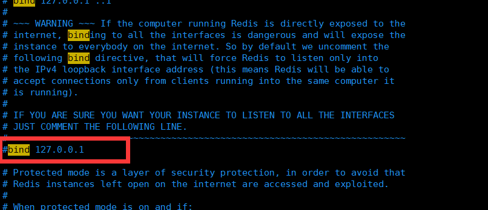

> 2、开启远程访问 protected-mode no 和 修改端口 port 7001

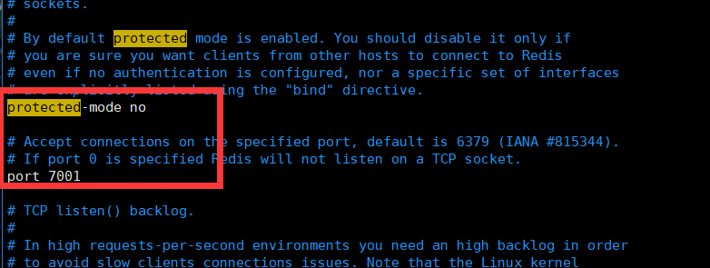

> 3、设置后台运行 daemonize yes

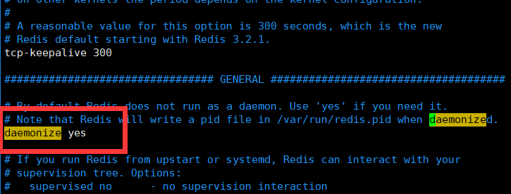

> 4、设置pidfile存放在 run目录下的文件名  pidfile  /var/run/redis_7001.pid

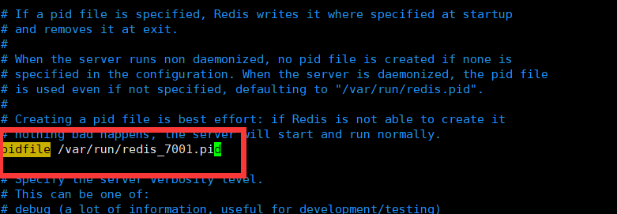

> 5、设置redis集群密码 masterauth 123456 和 requirepass 123456       注意：所有节点的密码都必须一致，masterauth也要加

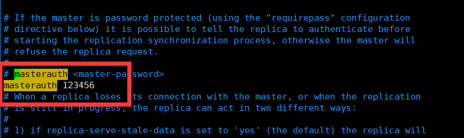

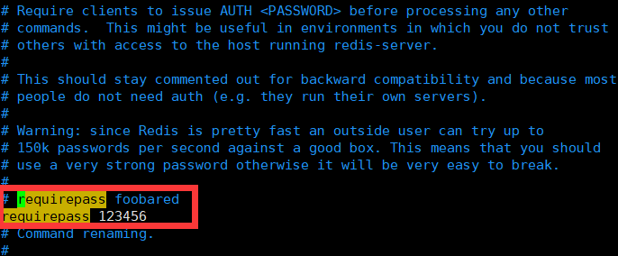

> 6、设置开启AOF模式  appendonly yes 

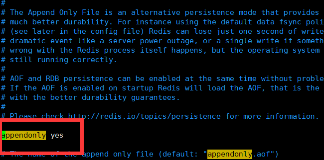

> 7、设置启用集群模式 cluster-enabled yes，开启配置文件cluster-config-file nodes.conf ，超时时间 cluster-node-timeout 5000

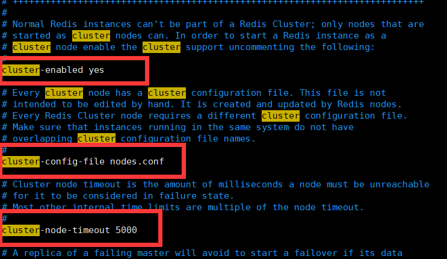

> 8、配置好后，拷贝 redis01再创建五个redis实例

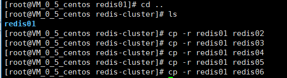

>9、修改redis02~06的配置文件，修改端口号，修改pidfile存放文件名

```shell
[root@VM_0_5_centos redis-cluster]# vim redis02/redis.conf 
[root@VM_0_5_centos redis-cluster]# vim redis03/redis.conf 
[root@VM_0_5_centos redis-cluster]# vim redis04/redis.conf 
[root@VM_0_5_centos redis-cluster]# vim redis05/redis.conf 
[root@VM_0_5_centos redis-cluster]# vim redis06/redis.conf 
```

> 10、在redis-cluster目录下，编写redis_start_all.sh启动脚本，启动redis实例

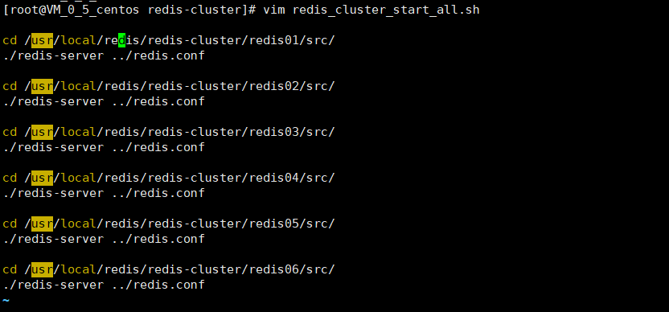

> 11、刚创建好的启动脚本没有权限，会提示Permission denied，所以需要给脚本添加可执行权限

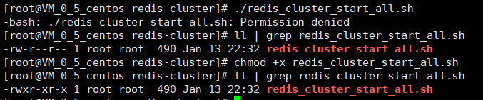

> > **权限部分说明**
> >
> > ```shel
> > -rw-r--r-- 1 root root  490 Jan 13 22:32 redis_cluster_start_all.sh
> > ```
> >
> > **含义**
> >
> > u 代表所有者（user）
> > g 代表所有者所在的组群（group）
> > o 代表其他用户（other）
> > a 代表全部的人（u、g、o）
> >
> > r 表示文件可读（read）
> > w 表示文件可写（write）
> > x 表示文件可执行（是程序）
> > – 表示相应的权限为空
> >
> > \+ 表示添加权限
> > – 表示删除权限
> > = 表示使之成为唯一的权限
> >
> > **数字表示**
> >
> > 0代表—
> > 1代表–x
> > 2代表-w-
> > 3代表-wx
> > 4代表r–
> > 5代表r-x
> > 6代表rw-
> > 7代表rwx
> >
> > -rw——-    (600) 只有所有者才有读和写的权限
> >
> > -rw-r–r–    (644) 只有所有者才有读和写的权限，组群和其他用户只有读的权限
> >
> > -rwx——    (700) 只有所有者才有读，写，执行的权限
> >
> > -rwxr-xr-x    (755) 只有所有者才有读，写，执行的权限，组群和其他用户只有读和执行的权限
> >
> > -rwx–x–x    (711) 只有所有者才有读，写，执行的权限，组群和其用户只有执行的权限
> >
> > -rw-rw-rw- (666) 每个人都有读写的权限
> >
> > -rwxrwxrwx (777) 每个人都有读写和执行的权限

> 12、启动redis集群

```shell
[root@VM_0_5_centos redis-cluster]# ./redis_cluster_start_all.sh
```

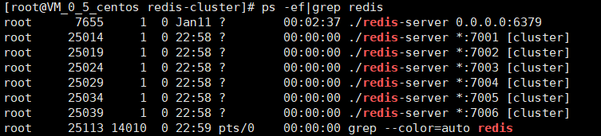

> 13、复进入到redis01/bin/ 目录下，拷贝一份 redis-cli 到  redis-cluster/ 目录下

```shell
[root@VM_0_5_centos src]# cp redis-cli /usr/local/redis/redis-cluster/
[root@VM_0_5_centos src]# ls ../../
redis01  redis02  redis03  redis04  redis05  redis06  redis-cli  redis_cluster_start_all.sh
```

> 14 、创建redis集群

```shell
[root@VM_0_5_centos redis-cluster]# ./redis-cli --cluster create 118.25.24.23:7001 118.25.24.23:7002 118.25.24.23:7003 118.25.24.23:7004 118.25.24.23:7005 118.25.24.23:7006 --cluster-replicas 1 -a 123456
Warning: Using a password with '-a' or '-u' option on the command line interface may not be safe.
>>> Performing hash slots allocation on 6 nodes...
Master[0] -> Slots 0 - 5460
Master[1] -> Slots 5461 - 10922
Master[2] -> Slots 10923 - 16383
Adding replica 118.25.24.23:7004 to 118.25.24.23:7001
Adding replica 118.25.24.23:7005 to 118.25.24.23:7002
Adding replica 118.25.24.23:7006 to 118.25.24.23:7003
>>> Trying to optimize slaves allocation for anti-affinity
[WARNING] Some slaves are in the same host as their master
M: b50c435cf63df50862a94dadadd9ca5e051449fd 118.25.24.23:7001
   slots:[0-5460] (5461 slots) master
M: acf23e9fdab3c902d3cdae65b3120361aabb916f 118.25.24.23:7002
   slots:[5461-10922] (5462 slots) master
M: 9608312874a165adcea031713c5256c4c3d7eb63 118.25.24.23:7003
   slots:[10923-16383] (5461 slots) master
S: 30a12a011575d62c8865c0e9249e7e768c1a9bae 118.25.24.23:7004
   replicates acf23e9fdab3c902d3cdae65b3120361aabb916f
S: 1733a42b8b6471f81d9dab5f8213ea62b1492fe8 118.25.24.23:7005
   replicates 9608312874a165adcea031713c5256c4c3d7eb63
S: dfac6c68ed0204eda79ceff6b4fd688b1e68df7e 118.25.24.23:7006
   replicates b50c435cf63df50862a94dadadd9ca5e051449fd
Can I set the above configuration? (type 'yes' to accept): yes
>>> Nodes configuration updated
>>> Assign a different config epoch to each node
>>> Sending CLUSTER MEET messages to join the cluster
Waiting for the cluster to join
...
>>> Performing Cluster Check (using node 118.25.24.23:7001)
M: b50c435cf63df50862a94dadadd9ca5e051449fd 118.25.24.23:7001
   slots:[0-5460] (5461 slots) master
   1 additional replica(s)
S: dfac6c68ed0204eda79ceff6b4fd688b1e68df7e 118.25.24.23:7006
   slots: (0 slots) slave
   replicates b50c435cf63df50862a94dadadd9ca5e051449fd
S: 1733a42b8b6471f81d9dab5f8213ea62b1492fe8 118.25.24.23:7005
   slots: (0 slots) slave
   replicates 9608312874a165adcea031713c5256c4c3d7eb63
M: acf23e9fdab3c902d3cdae65b3120361aabb916f 118.25.24.23:7002
   slots:[5461-10922] (5462 slots) master
   1 additional replica(s)
S: 30a12a011575d62c8865c0e9249e7e768c1a9bae 118.25.24.23:7004
   slots: (0 slots) slave
   replicates acf23e9fdab3c902d3cdae65b3120361aabb916f
M: 9608312874a165adcea031713c5256c4c3d7eb63 118.25.24.23:7003
   slots:[10923-16383] (5461 slots) master
   1 additional replica(s)
[OK] All nodes agree about slots configuration.
>>> Check for open slots...
>>> Check slots coverage...
[OK] All 16384 slots covered.
```

> 15、在redis-cluster目录下，编写redis_cluster_stop_all.sh关闭脚本

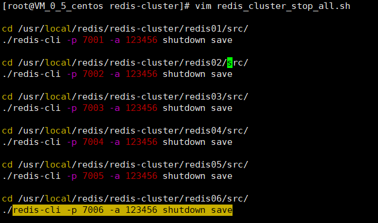

> 16、给redis_cluster_stop_all.sh脚本添加可执行权限(参考11点给启动脚本添加权限)

```shell
[root@VM_0_5_centos redis-cluster]# ll | grep redis_cluster_stop_all.sh
-rw-r--r-- 1 root root     552 Jan 14 10:42 redis_cluster_stop_all.sh
[root@VM_0_5_centos redis-cluster]# chmod +x redis_cluster_stop_all.sh 
[root@VM_0_5_centos redis-cluster]# ll | grep redis_cluster_stop_all.sh
-rwxr-xr-x 1 root root     552 Jan 14 10:42 redis_cluster_stop_all.sh
```

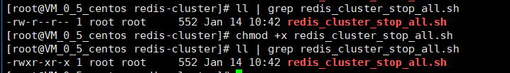

> 17、执行停止脚本

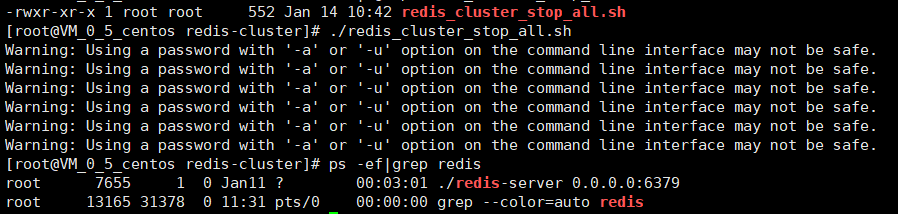

