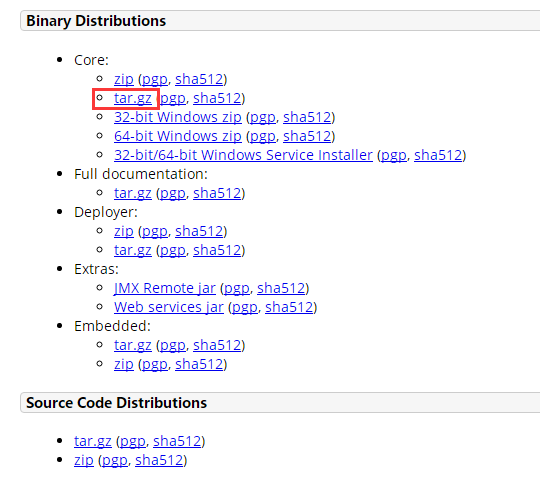
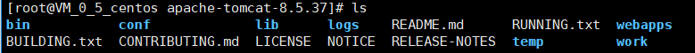
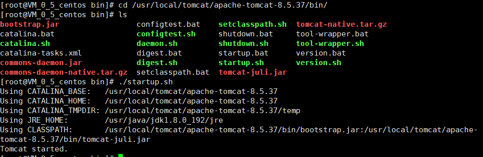
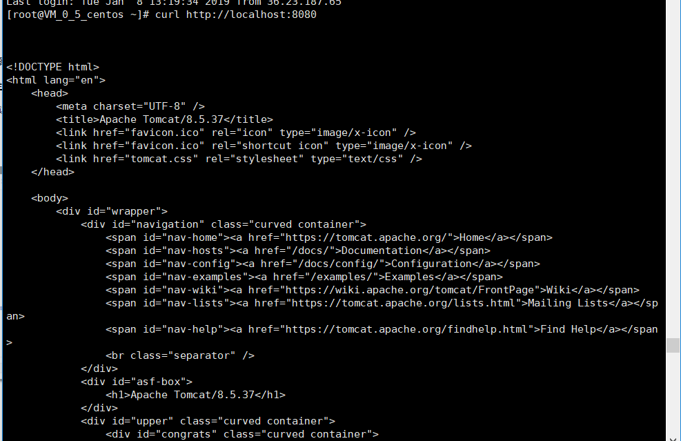
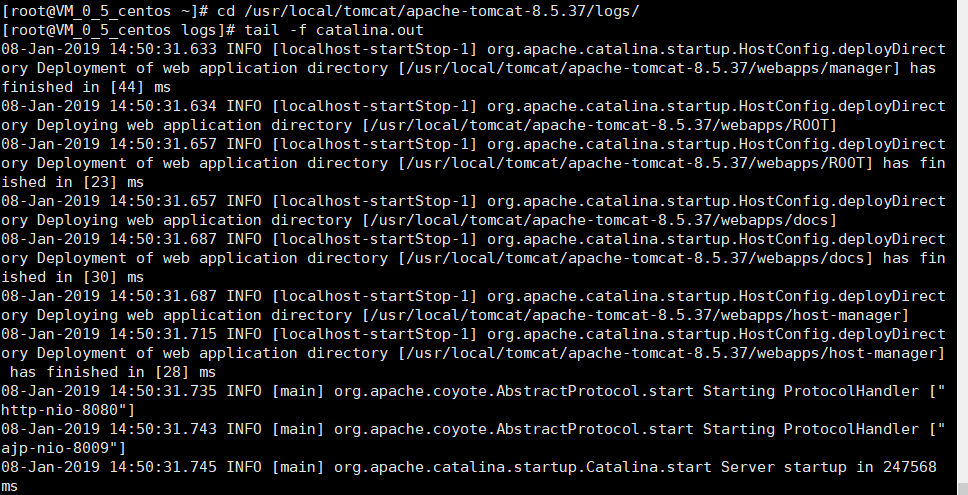
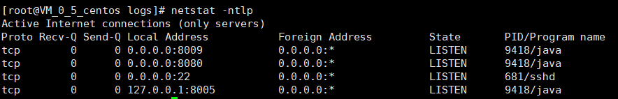
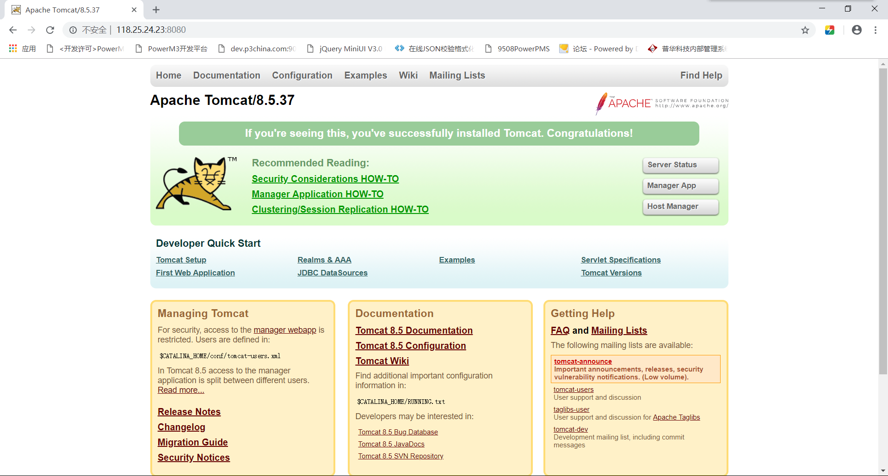

## CentOS7.2 安装tomcat8.5

#### 1.  [官网下载](http://tomcat.apache.org/download-80.cgi)tomcat压缩包



#### 2. 上传至云服务器（本人使用xFtp6上传）

#### 3. 执行解压操作

```shell
[root@VM_0_5_centos tomcat]# tar -zxvf apache-tomcat-8.5.37
[root@VM_0_5_centos tomcat]# ls
apache-tomcat-8.5.37  apache-tomcat-8.5.37.tar.gz
```

> 解压后文件目录结构



#### 4. 查看是否已经正确配置JAVA_HOME，输出JAVA_HOME路径

```shell
[root@VM_0_5_centos apache-tomcat-8.5.37]# echo $JAVA_HOME
/usr/java/jdk1.8.0_192
```

#### 5. 可以将解压后的tomcat文件复制到所需位置

```shell
[root@VM_0_5_centos tomcat]# cp -r /usr/tomcat/apache-tomcat-8.5.37 /usr/local/tomcat/
[root@VM_0_5_centos tomcat]# ls /usr/local/tomcat/
apache-tomcat-8.5.37
```

#### 6. 进入bin文件，启动tomcat



#### 7. 查看是否启动成功

```shell
#访问8080端口出现html代码即启动成功
[root@VM_0_5_centos ~]# curl http://localhost:8080
```



#### 8. 查看tomcat启动日志

```shell
[root@VM_0_5_centos ~]# cd /usr/local/tomcat/apache-tomcat-8.5.37/logs/
[root@VM_0_5_centos logs]# tail -f catalina.out
```



#### 9. 查看端口监听

```shell
#查看所有端口
[root@VM_0_5_centos logs]# netstat -ntlp  
#查看指定端口
[root@VM_0_5_centos logs]# netstat -an | grep 8080
tcp        0      0 0.0.0.0:8080            0.0.0.0:*               LISTEN    
```



#### 10. 本地浏览器打开直接可以远程访问8080端口(本人使用的是腾讯云，其他云可能需要设置一下防火墙，具体情况具体分析)



