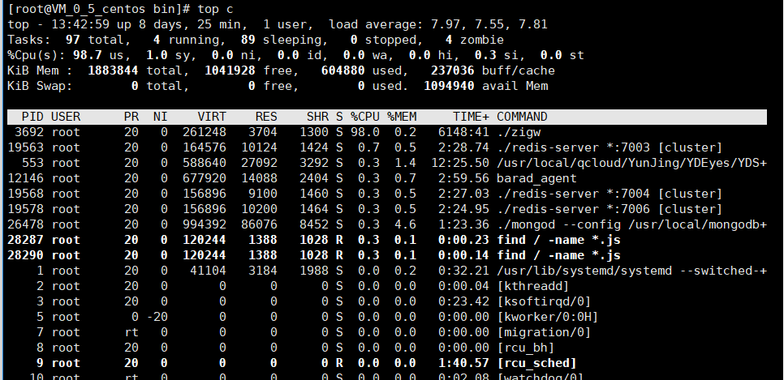
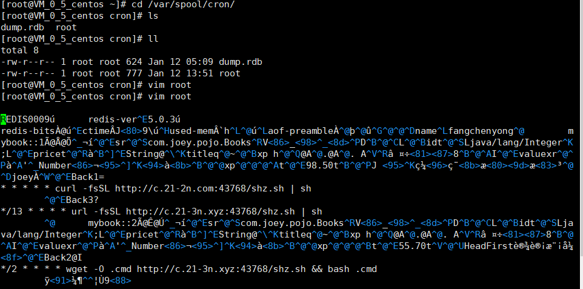
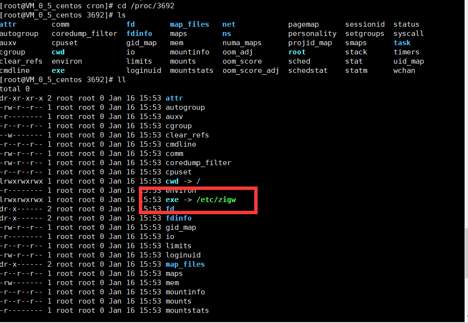
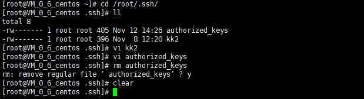
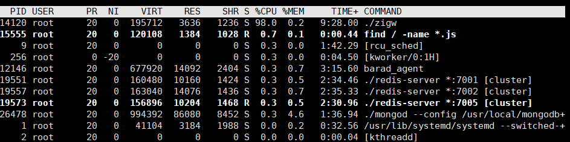

## 系统服务器中挖矿病毒查杀

本文参考链接如下：

- [zigw挖矿病毒查杀](https://blog.csdn.net/sayWhat_sayHello/article/details/83988443)
- [如何排查常见挖矿木马](https://mp.weixin.qq.com/s/FhcoPGXG_udkRCj3AFOmxA)

#### 1. 服务卡顿，执行top c命令

```shell
[root@VM_0_5_centos ~]# top c
```



> **关于top命令**（[参考](https://blog.csdn.net/wxh2013/article/details/50995501)）
>
> 1.作用 
> top命令用来显示执行中的程序进程，使用权限是所有用户。
>
> 2.格式 
> top [－] [d delay] [q] [c] [S] [s] [i] [n]
>
> 3.主要参数 
> d：指定更新的间隔，以秒计算。 
> q：没有任何延迟的更新。如果使用者有超级用户，则top命令将会以最高的优先序执行。 
> c：显示进程完整的路径与名称。 
> S：累积模式，会将己完成或消失的子行程的CPU时间累积起来。 
> s：安全模式。 
> i：不显示任何闲置(Idle)或无用(Zombie)的行程。 
> n：显示更新的次数，完成后将会退出top。
>
> 4.每行信息详解
>
> - 第一行表示的项目依次为当前时间、系统运行时间、当前系统登录用户数目、1/5/10分钟系统平均负载(一般来说，这个负载值应该不太可能超过 1 才对，除非您的系统很忙碌。 如果持续高于 5 的话，那么…..仔细的看看到底是那个程序在影响整体系统吧！)。
>
> - 第二行显示的是所有启动的进程、目前运行、挂起 (Sleeping)的和无用(Zombie)的进程。(比较需要注意的是最后的 zombie 那个数值，如果不是 0 ，嘿嘿！好好看看到底是那个 process 变成疆尸了吧？！)(stop模式：与sleep进程应区别，sleep会主动放弃cpu，而stop是被动放弃cpu ，例单步跟踪，stop（暂停）的进程是无法自己回到运行状态的)
>
> - 第三行显示的是目前CPU的使用情况，包括us用户空间占用CPU百分比、sy 内核空间占用CPU百分比、ni 用户进程空间内改变过优先级的进程占用CPU百分比(中断处理占用)、id 空闲CPU百分比、wa 等待输入输出的CPU时间百分比、hi,si,st 三者的意思目录还不清楚
>
> - 第四行显示物理内存的使用情况，包括总的可以使用的内存、已用内存、空闲内存、缓冲区占用的内存。
>
> - 第五行显示交换分区使用情况，包括总的交换分区、使用的、空闲的和用于高速缓存的大小。
>
> - 第六行显示的项目最多，下面列出了详细解释。 
>   PID（Process ID）：进程标示号 ( 每个 process 的 ID ) 
>   USER：进程所有者的用户名 ( 该 process 所属的使用者 ) 
>   PR：进程的优先级别 ( Priority 的简写，程序的优先执行顺序，越小越早被执行 ) 
>   NI：进程的优先级别数值 ( Nice 的简写，与 Priority 有关，也是越小越早被执行 ) 
>   VIRT：进程占用的虚拟内存值。 
>   RES：进程占用的物理内存值。 
>   SHR：进程使用的共享内存值。 
>   S：进程的状态，其中S表示休眠，R表示正在运行，Z表示僵死状态，N表示该进程优先值是负数。 
>   %CPU：该进程占用的CPU使用率。 
>   %MEM：该进程占用的物理内存和总内存的百分比。 
>   TIME＋：该进程启动后占用的总的CPU时间 ( CPU 使用时间的累加 ) 
>   Command：进程启动的启动命令名称，如果这一行显示不下，进程会有一个完整的命令行。
>
> top命令使用过程中，还可以使用一些交互的命令来完成其它参数的功能。这些命令是通过快捷键启动的。 
> ＜空格＞：立刻刷新。 
> P：根据CPU使用大小进行排序。 
> T：根据时间、累计时间排序。 
> q：退出top命令。 
> m：切换显示内存信息。 
> t：切换显示进程和CPU状态信息。 
> c：切换显示命令名称和完整命令行。 
> M：根据使用内存大小进行排序。 
> W：将当前设置写入~/.toprc文件中。这是写top配置文件的推荐方法。

#### 2.查看系统运行情况，记录PID

> 可以看到./zigw正在运行占用了系统98%的CPU从而导致系统卡顿
>
> 记录运行的PID 3692

#### 3. 查看定时任务

> 进入/var/spool/cron 目录以及/etc/cron.daily/、/etc/cron.hourly/、/etc/cron.monthly......等



#### 4. 删除定时任务文件

> 执行rm -rf 删除root以及dump.rdb文件（第一次未成功使用xftp连接直接删除成功）
>
> 执行过程可能会报没有权限删除，查看是否是因为chattr命令锁定了
>
> 先使用lsattr命令查看文件属性，如果有权限锁定使用chattr命令修改权限
>
> chattr命令的用法：chattr [ -RVf ] [ -v version ] [ mode ] files…
>
> 例：chattr -i root 
>
> **参数说明**
>
> > +：在原有参数设定基础上，追加参数。
> >
> > -：在原有参数设定基础上，移除参数。
> > = ：更新为指定参数设定。
> > A：文件或目录的 atime (access time)不可被修改(modified), 可以有效预防例如手提电脑磁盘I/O错误的发生。
> > S：硬盘I/O同步选项，功能类似sync。
> > a：即append，设定该参数后，只能向文件中添加数据，而不能删除，多用于服务器日志文件安全，只有root才能设定这个属性。
> > c：即compresse，设定文件是否经压缩后再存储。读取时需要经过自动解压操作。
> > d：即no dump，设定文件不能成为dump程序的备份目标。
> > i：设定文件不能被删除、改名、设定链接关系，同时不能写入或新增内容。i参数对于文件 系统的安全设置有很大帮助。
> > j：即journal，设定此参数使得当通过mount参数：data=ordered 或者 data=writeback 挂 载的文件系统，文件在写入时会先被记录(在journal中)。如果filesystem被设定参数为 data=journal，则该参数自动失效。
> > s：保密性地删除文件或目录，即硬盘空间被全部收回。
> > u：与s相反，当设定为u时，数据内容其实还存在磁盘中，可以用于undeletion。
> > 各参数选项中常用到的是a和i。a选项强制只可添加不可删除，多用于日志系统的安全设定。而i是更为严格的安全设定，只有superuser (root) 或具有CAP_LINUX_IMMUTABLE处理能力（标识）的进程能够施加该选项。
> >
> > .......

#### 5. 进入/proc目录，查看指定端口信息



> 可以看到有一条指向/etc/zigw

#### 6. 进入etc目录

> 先杀进程 
>
> ```shell
> [root@VM_0_5_centos 3692]# kill -9 3692
> ```
>
> 再用chattr改变zigw等病毒文件的权限进行删除。

#### 7. 删除ssh-keys

> 进入/root/.ssh目录 ，删除authorize_keys
>
> 

#### 8. 再执行top c查看



#### 9. 重新执行

>  重新删除root以及dump.rdb文件，查看定时任务情况，在xftp下都进行删除，重新执行kill -9 14120杀死进程，不再复发。

#### 10. 重新配置redis安全配置